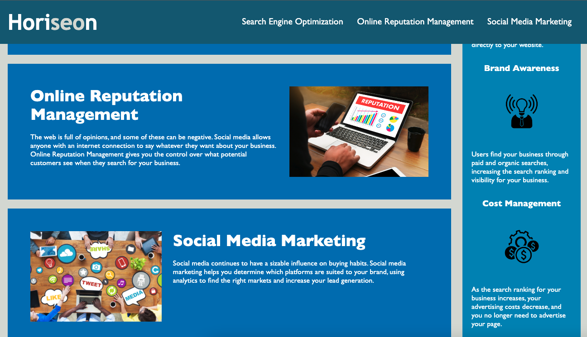

# Horiseon

## Description 

This is a static webpage which contains information about Horiseon, a Marketing company who specialise in SEO and Social Media. There are two primary content areas which detail the benefits of the service and the areas of expertise. Beyond that, there is a Navigation, Hero and Footer as it generally conventional. 
The original code was supplied to me and his since been updated and enhanced to improve the accessibility of the content. Amongst other things, a sticky navigation has been deployed using a combination of CSS and Javascript. Improvements have also been made to the semantic HTML structure and images have been reduced in order to improve load times.

## Installation

To review the updated work, please follow this URL: https://michaelfriel.github.io/Code-Refactor/

The code is available to be cloned from the Code-Refactor repository, using git commands. URL here: https://github.com/MichaelFriel/Code-Refactor

## Usage

The usage is very typical of a standard webpage, with a navigation to anchor you to important content. 

## License

Please see Mit License contained within repository.